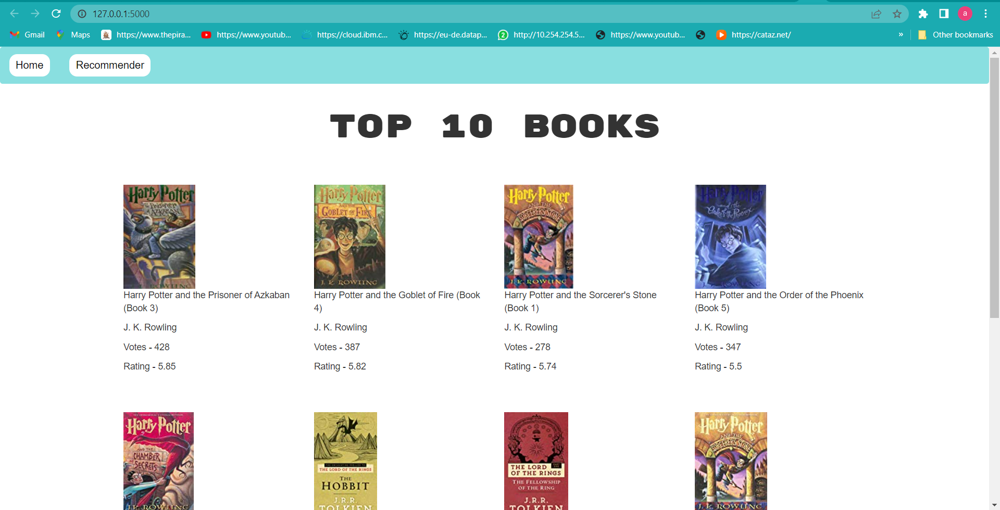
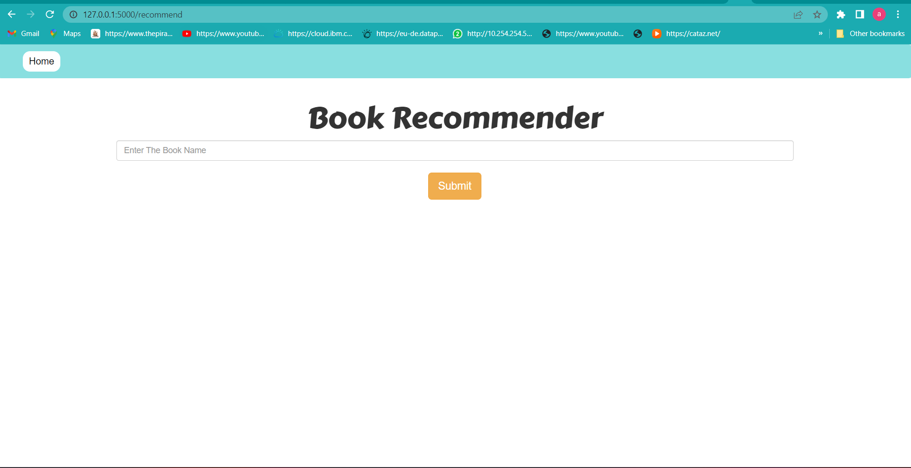
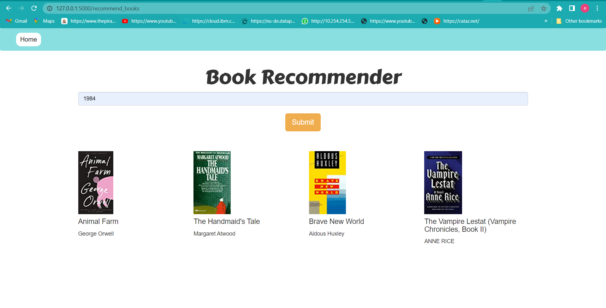

# Book-Recommendation-System

### Software and Tools Requirements
1. [GitHub Account](https://www.github.com) 
2. [Pycharm IDE](https://www.jetbrains.com/pycharm) 
3. [GitCLI](https://git-scm.com/downloads)
4. [python]()
5. [Anaconda]()
6. [jupyter]()
7. [scikit-learn]()
8. [Plotly]()
9. [numpy]()
10. [Pandas]()
----------------------------------------

This is an End to End Project where a web app is created to show how the model works and
interacts with the a front end structure.

The screenshot of the web app are given below:

The first page shows the top 10 books based on rating.Two options home and Recommender will
open new page for recommendation while home will take to the default home page

the recommender looks like this:

Here we can provide the book name and its corresponding similar type of books will be shown
the output will be somthing like:

